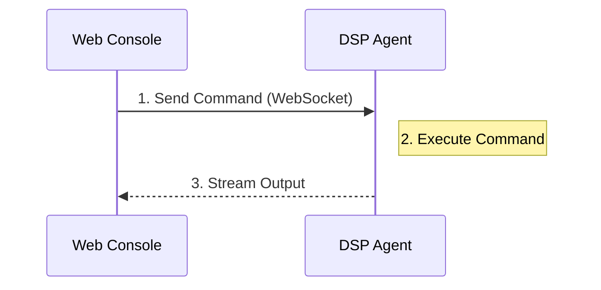

# Terminal Console

Panduan penggunaan Terminal Console untuk remote command execution.

## Overview

Terminal Console adalah fitur admin-only untuk menjalankan command secara remote dari Master ke Agent. Semua command ter-log untuk audit trail.

:::warning Admin Only
Terminal Console hanya tersedia untuk user dengan role **Admin**. User dengan role Viewer tidak memiliki akses.
:::

## Access Terminal

1. Login sebagai Admin
2. Navigate ke **Terminal** di sidebar
3. Pilih Agent yang ingin di-remote
4. Jalankan command

## Features

| Feature | Description |
|---------|-------------|
| Remote Execution | Jalankan command di Agent dari Master |
| Real-time Output | Lihat output command secara live |
| Command History | History command yang pernah dijalankan |
| Audit Logging | Semua command ter-log untuk compliance |

## Usage Example

### Check Disk Space

```bash
df -h
```

### Check System Memory

```bash
free -m
```

### Check Database Connection

```bash
psql -h localhost -U postgres -c "SELECT 1"
```

### Check Running Processes

```bash
ps aux | grep dsp
```

## Security

### Audit Logging

Setiap command yang dijalankan tercatat di Audit Log:

```
[2024-01-15 10:30:45] admin@192.168.1.100 executed on agent-kantor-a: df -h
[2024-01-15 10:31:02] admin@192.168.1.100 executed on agent-kantor-a: free -m
```

### Role-Based Access

| Role | Terminal Access |
|------|----------------|
| Admin | ✅ Full access |
| Viewer | ❌ No access |

## Best Practices

:::tip Recommendations
1. **Use sparingly** - Hanya gunakan untuk troubleshooting
2. **Document commands** - Catat alasan menjalankan command
3. **Avoid destructive commands** - Jangan jalankan `rm -rf` atau sejenisnya
4. **Review audit logs** - Cek secara berkala untuk anomali
:::

## Architecture


