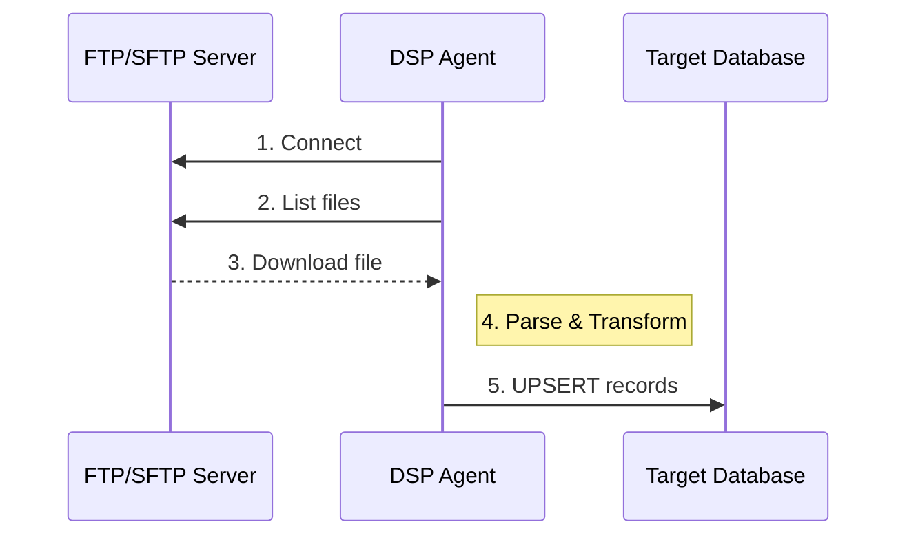

# FTP/SFTP File Sync

Panduan sinkronisasi data dari FTP dan SFTP server.

## Overview

DSP Platform mendukung penarikan data dari file server via FTP dan SFTP. Format file yang didukung:

| Format | Extension | Description |
|--------|-----------|-------------|
| CSV | `.csv` | Comma-separated values |
| JSON | `.json` | JavaScript Object Notation |
| Excel | `.xlsx`, `.xls` | Microsoft Excel |

## Use Cases

- **Legacy System Integration** - Tarik data dari sistem yang export ke file
- **Batch Processing** - Proses file harian/mingguan dari FTP server
- **Data Exchange** - Terima data dari partner via SFTP

## Setup Connection

### FTP Connection

```json
{
  "name": "FTP Data Server",
  "source_type": "ftp",
  "source_config": {
    "host": "ftp.example.com",
    "port": 21,
    "username": "ftpuser",
    "password": "password",
    "path": "/data/exports"
  }
}
```

### SFTP Connection (Recommended)

```json
{
  "name": "SFTP Secure Server",
  "source_type": "sftp",
  "source_config": {
    "host": "sftp.example.com",
    "port": 22,
    "username": "sftpuser",
    "password": "password",
    "path": "/data/exports"
  }
}
```

:::tip Security
Gunakan SFTP (port 22) daripada FTP (port 21) untuk transfer data yang aman dengan enkripsi.
:::

## Create File Sync Job

1. Go to **Jobs** → **Create Job**
2. Pilih **Network** dengan source type FTP/SFTP
3. Konfigurasi file pattern

### File Pattern Configuration

```json
{
  "file_pattern": "*.csv",
  "file_format": "csv",
  "delimiter": ",",
  "has_header": true,
  "date_format": "YYYY-MM-DD"
}
```

### Column Mapping

Map kolom dari file ke target database:

```json
{
  "columns": [
    {"source": "col1", "target": "user_id", "type": "integer"},
    {"source": "col2", "target": "email", "type": "string"},
    {"source": "col3", "target": "created_at", "type": "timestamp"}
  ]
}
```

## Processing Flow



## File Formats

### CSV

```csv
id,name,email,created_at
1,John Doe,john@example.com,2024-01-15
2,Jane Smith,jane@example.com,2024-01-16
```

### JSON

```json
[
  {"id": 1, "name": "John Doe", "email": "john@example.com"},
  {"id": 2, "name": "Jane Smith", "email": "jane@example.com"}
]
```

## Best Practices

:::tip Recommendations
1. **Use SFTP** - Lebih aman daripada FTP
2. **Archive processed files** - Pindahkan file yang sudah diproses
3. **Error handling** - Monitor failed file processing
4. **Scheduling** - Jalankan setelah file tersedia (cron)
:::

## Troubleshooting

| Error | Solution |
|-------|----------|
| Connection refused | Pastikan FTP/SFTP service running |
| Permission denied | Check user permissions di path |
| File not found | Verify file pattern dan path |
| Parse error | Check file format dan delimiter |
