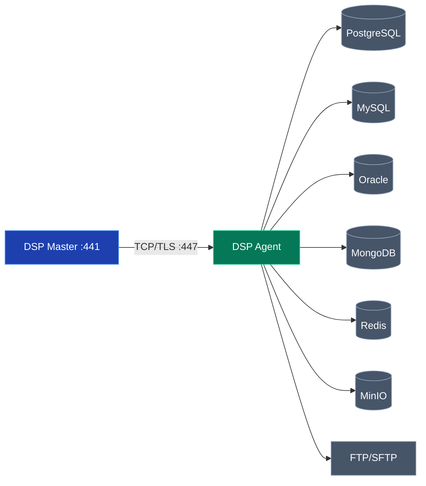

# Agent Installation

Panduan instalasi DSP Tenant Agent untuk menghubungkan server remote ke Master.

## Overview

DSP Agent adalah komponen yang dijalankan di server tenant/cabang. Agent mendukung berbagai sumber data:

- **Database**: PostgreSQL, MySQL, SQL Server, Oracle
- **NoSQL**: MongoDB, Redis
- **Object Storage**: MinIO (MinIO-to-MinIO Mirror)
- **File**: FTP, SFTP (CSV, JSON, Excel)
- **API**: REST API external



## Key Features

- **Auto-connect** - Reconnection otomatis ke Master
- **Multi-Source Sync** - Database, NoSQL, File, REST API
- **Service Mode** - Windows Service atau Linux Systemd
- **Streaming** - Batch processing untuk data besar

## Installation

### Download/Build Binary

```bash
# Build dari source
git clone https://github.com/alfalaq12/dsp-platform.git
cd dsp-platform
./scripts/build-release.sh 1.0.0

# Binary akan ada di ./releases/
```

### Configuration

Buat file `.env` dari template:

```bash
cp .env.example .env
```

Edit `.env`:

```bash
# Master Connection
MASTER_HOST=192.168.1.100    # IP/hostname Master Server
MASTER_PORT=447              # Port Agent Listener (atau 8447)

# Agent Identity
AGENT_NAME=kantor-cabang-a   # Nama unik agent
AGENT_TOKEN=paste-token-dari-dashboard

# TLS (sesuaikan dengan Master)
TLS_ENABLED=false

# Source DB settings di-push dari Master (Network config)
```

:::tip Get Agent Token
1. Login ke DSP Master Dashboard
2. Go to **Settings** → **Agents**
3. Klik **Generate Token**
4. Copy token dan paste ke `.env`
:::

## Running Agent

### Manual

```bash
./dsp-agent
```

### Systemd Service (Linux)

Buat file `/etc/systemd/system/dsp-agent.service`:

```ini
[Unit]
Description=DSP Tenant Agent
After=network.target

[Service]
Type=simple
User=dsp
WorkingDirectory=/opt/dsp-agent
ExecStart=/opt/dsp-agent/dsp-agent
Restart=always
RestartSec=5
EnvironmentFile=/opt/dsp-agent/.env

[Install]
WantedBy=multi-user.target
```

Start service:

```bash
sudo systemctl daemon-reload
sudo systemctl enable dsp-agent
sudo systemctl start dsp-agent
sudo systemctl status dsp-agent
```

### Windows Service

```powershell
# Install sebagai service
sc.exe create DSPAgent binPath= "C:\dsp-agent\dsp-agent.exe" start= auto
sc.exe start DSPAgent
```

## Verify Connection

Setelah agent berjalan, cek di Master Dashboard:

1. Go to **Dashboard** atau **Settings** → **Agents**
2. Agent akan muncul dengan status **Online** (hijau)

### Check Agent Logs

```bash
# Linux
journalctl -u dsp-agent -f

# Windows
Get-Content C:\dsp-agent\logs\agent.log -Wait
```

## Troubleshooting

### Agent tidak connect

| Problem | Solution |
|---------|----------|
| Connection refused | Pastikan Master running dan port terbuka |
| Invalid token | Generate token baru dari Dashboard |
| TLS error | Pastikan `TLS_ENABLED` sama di Master & Agent |

### Check Firewall

```bash
# Linux - buka port untuk Agent ke Master
sudo ufw allow out 447/tcp

# atau jika pakai port custom
sudo ufw allow out 8447/tcp
```

### Test Connection Manual

```bash
# Test apakah Master reachable
telnet 192.168.1.100 447

# atau dengan nc
nc -zv 192.168.1.100 447
```

## Port Configuration

| Setting | Default | Description |
|---------|---------|-------------|
| MASTER_PORT | 447 | Port TCP Master (sesuaikan dengan `TCP_PORT` di Master) |

:::info Custom Port
Jika Master menggunakan port custom (misal `TCP_PORT=8447`), pastikan Agent juga menggunakan `MASTER_PORT=8447`
:::
