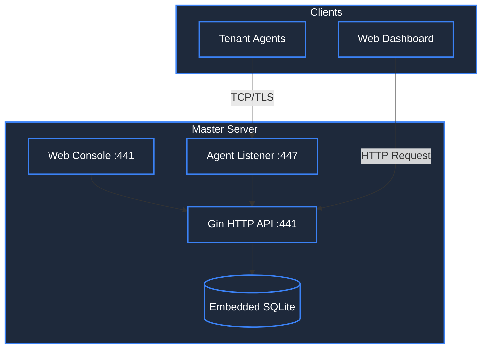

# Welcome to DSP Platform

**DSP (Data Synchronization Platform)** adalah platform sinkronisasi data terpusat dengan arsitektur Master-Agent untuk kebutuhan enterprise dan pemerintahan Indonesia.

## 🎯 What is DSP?

DSP adalah solusi lengkap untuk penarikan dan sinkronisasi data dengan performa tinggi menggunakan Gin framework (2x lebih cepat). Platform ini mendukung berbagai sumber data:

- **Database** - PostgreSQL, MySQL, SQL Server, Oracle
- **NoSQL** - MongoDB, Redis
- **Object Storage** - MinIO (Mirroring)
- **File** - FTP, SFTP (CSV, JSON, Excel)
- **REST API** - Fetch dari endpoint external (semua methods & auth)

## 🏗️ Architecture Overview



## 🚀 Quick Start

### Prerequisites

- **Linux/macOS/Windows** - DSP mendukung semua platform utama
- **Port 441** - Untuk Master Console/Web UI (customizable)
- **Port 447** - Untuk Agent Listener/TCP (customizable)

### Installation

```bash
# Clone & Build
git clone https://github.com/alfalaq12/dsp-platform.git
cd dsp-platform

# Build untuk semua platform
./scripts/build-release.sh 1.0.0

# Jalankan Master
./dsp-master
```

Akses web console di `http://localhost:441`

**Login Default:** `admin` / `admin` (wajib ganti saat pertama login!)

## ✨ Key Features

### Master Server
| Feature | Description |
|---------|-------------|
| Single Binary | Tidak butuh install database server terpisah |
| REST API | JWT Auth, Management Schema/Network/Job |
| Agent Listener | Real-time monitoring & config push |
| Web Dashboard | Modern UI (React/Vite) ter-bundle di binary |
| Target Database | Push data ke PostgreSQL, MySQL, Oracle |
| UPSERT Support | Update or Insert otomatis untuk sync berulang |

### Tenant Agent
| Feature | Description |
|---------|-------------|
| Auto-connect | Reconnection otomatis ke Master |
| Multi-Source Sync | Database, NoSQL, File, REST API |
| Service Mode | Windows Service atau Linux Systemd |
| Streaming | Batch processing untuk data besar |

### Security
| Feature | Description |
|---------|-------------|
| JWT Authentication | Token dengan HttpOnly Cookies |
| Password Hashing | Bcrypt |
| TLS Support | Optional TLS/SSL untuk TCP dan HTTP |
| RBAC | Role-based access (Admin/Viewer) |
| Audit Log | Semua aksi user ter-log |
| Session Timeout | Auto-logout setelah 30 menit idle |
| Terminal Console | Admin-only dengan command logging |

## 📚 Documentation Sections

| Section | Description |
|---------|-------------|
| [Getting Started](/docs/category/getting-started) | Panduan cepat memulai DSP |
| [Installation](/docs/category/installation) | Instalasi Master dan Agent |
| [Configuration](/docs/category/configuration) | Konfigurasi environment dan security |
| [Database Sync](/docs/category/database-sync) | Setup job sync database |
| [File Sync](/docs/category/file-sync) | FTP/SFTP integration |
| [Network Setup](/docs/category/network) | Konfigurasi connections |
| [API Reference](/docs/category/api-reference) | REST API documentation |

## 📚 Project Structure

```
dsp-platform/
├── cmd/
│   ├── master/          # Master server entry
│   └── agent/           # Agent entry
├── internal/
│   ├── core/            # Models & types
│   ├── auth/            # JWT middleware
│   ├── database/        # DB connections
│   ├── filesync/        # FTP/SFTP/API clients
│   ├── server/          # HTTP handlers & TCP listener
│   └── security/        # TLS utilities
├── frontend/            # React + Vite
│   ├── src/
│   │   ├── pages/       # Dashboard, Jobs, Terminal, etc
│   │   ├── components/  # Reusable UI components
│   │   └── services/    # API client
│   └── dist/            # Production build
└── scripts/
    ├── build-release.ps1
    └── build-release.sh
```

## 🔗 Useful Links

- [GitHub Repository](https://github.com/alfalaq12/dsp-platform)
- [Issue Tracker](https://github.com/alfalaq12/dsp-platform/issues)
- [Changelog](/blog)

## 📞 Support

Email: [bintangal.falag@gmail.com](mailto:bintangal.falag@gmail.com)

---

**DSP Platform - Sinkronisasi data enterprise yang simpel dan powerful 🚀**
